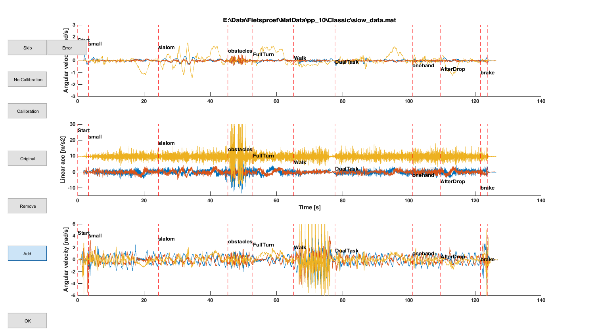

## Trigger pulse correction

I noticed that that in about 30% of the files we have an unexpected number of trigger pulses. I don't know if this is a software error (in MT manager) or a problem with the trigger pulse or the Xsens analog station. We will solve this by analyzing the files with errors visually.

I created a matlab code that

- Identifies the trials with an unexpected number of trigger pulses (accounting for the fact that the normal cycling trial is always the one with the callibration pulses)
- A GUI to manually edit the trigger pulses in the files with an unexpected number of pulses.


### Overview GUI




In this figure you can see the

- angular velocity of the bike frame in the world (z is vertical) (top row)
- linear acceleration of the bike frame in the world (middle row)
- angular velocity of the left knee IMU in the world (bottom row)
- Trigger pulses with the red dotted vertical lines
- start of identified phase in the cycling parcours (in black text)

With the buttons you can:

- State that this figure is OK. The triggers and phases will be saved to the .mat file with all data
- Remove a trigger pulse. Click on the button "Remove" and then click on the figure. Matlab will select the red line that is closest to the point you selected and will remove this trigger pulse from the data
- In a similar manner you can "Add" trigger pulses
- With to button original you can back to the original pulses in the file (without manual editting)
- with the buttons "No Callibration" or "callibration" you can add or remove a phase for the callibration.
- With "Skip" you can ignore this trial and save it for later
- With "Error" you can indicate that we will not use this trial in the analysis.


### Workflow

Note that you should be carefull to not overwrite the manual work that you have been doing. Therefore you should always follow the following order

1) **ExampleBatch2.m**: Combine the raw txt files and  save it as .mat files in a specific folder (for more information see manual in folder InfoProcessing)

```matlab
OutPath  = 'E:\Data\Fietsproef\MatData';
```

2) **CleanUp_TriggerPulses.m**: here you will manually adapt the trigger pulses using this GUI. This will append the corrected trigger pulses to the .mat file.

As you can see, if you do step 1 and 2 but then decide the run step 1 (ExampleBatch2.m) again for some reasions without adapting the path where you want to save the .mat files (i.e. OutPath). You will overwrite the work you have been doing in step 2. So always be carefull when you run ExampleBatch2 !


let me know when things are unclear (maarten.afschrift@kuleuven.be)


