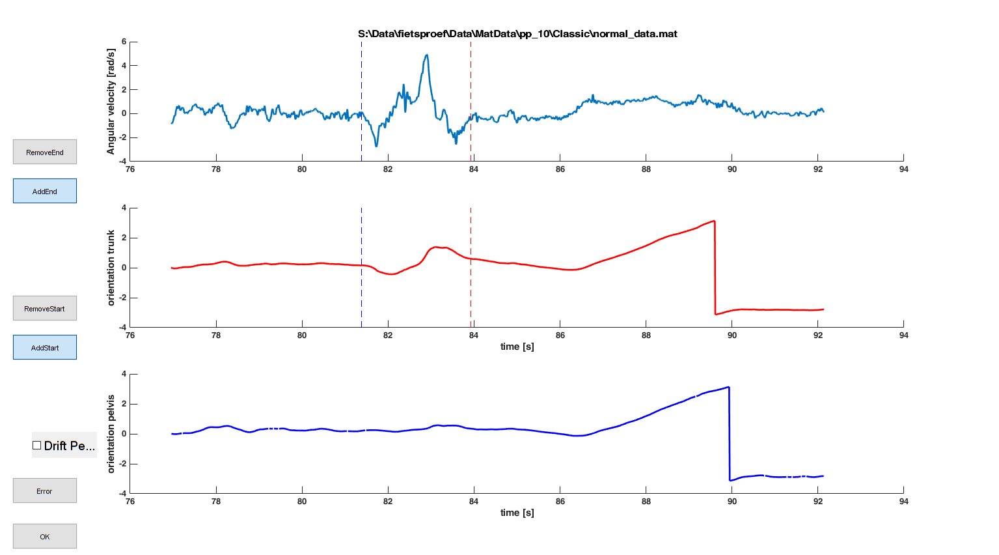

## Gui event detection shoulder check

The start and end of the rotation of the head over the left and right shoulder are hard to detect and is therefore done using this GUI.

### How to run

Run the script **DetectPhasesShoulderCheck.m**

### Controls

In this figure you can see the

- angular velocity trunk IMU around vertical axis
- orientation trunk IMU (vertical axis)
- orientation pelvis IMU (vertical axis)

With the buttons you can:

- OK: end the processing of this figure
- Error: indicate that this figure does not make much sense  (this will be skipped)
- AddStart & RemoveStart: add/remove the start event of the shoulder rotation
- AddEnd & RemoveEnd: add/remove the event event of the shoulder rotation
- Drift Pelvis: indicate the there is drift on the pelvis sensor (lowest subplot)

### varia

let me know when things are unclear (maarten.afschrift@kuleuven.be)

