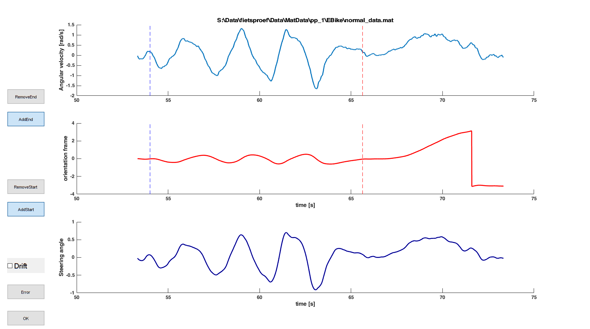

## Gui event detection slalom

The start and end of the slalom are hard to detect and is therefore done using this GUI.

### How to run

Run the script **DetectPhases_Slalom.m**

### Controls

In this figure you can see the

- angular velocity bike-frame IMU around vertical axis
- orientation bik-frame IMU (vertical axis)
- steering angle IMU (see manual on determining steering angle)

With the buttons you can:

- OK: end the processing of this figure
- Error: indicate that this figure does not make much sense  (this will be skipped)
- AddStart & RemoveStart: add/remove the start event of the slalom
- AddEnd & RemoveEnd: add/remove the event event of the slalom
- Drift: indicate the there is drift on the steering angle (lowest subplot)

### varia

let me know when things are unclear (maarten.afschrift@kuleuven.be)

