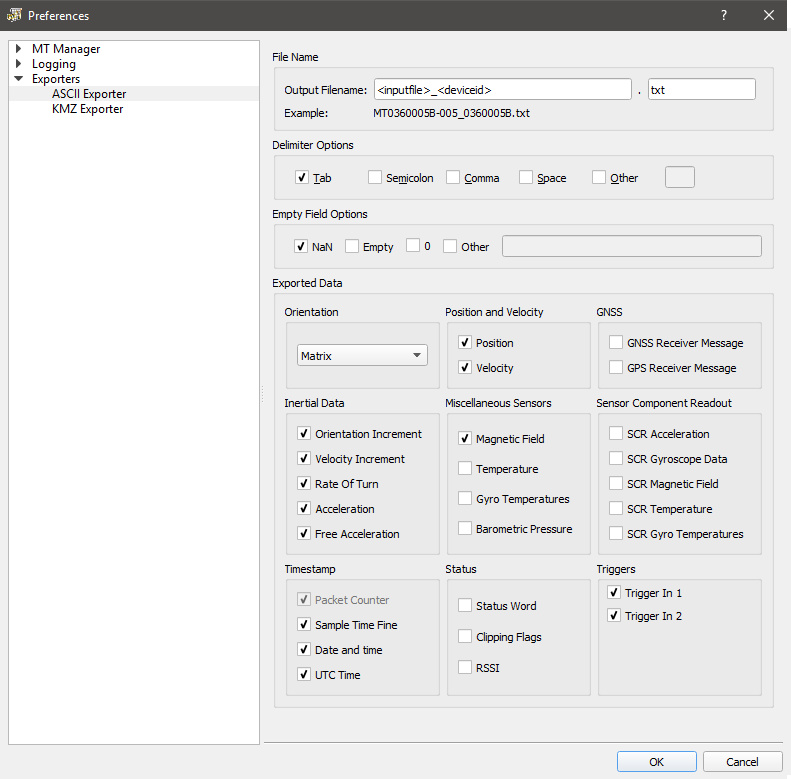

# Processing IMU data : Cycling project


## Processing in MT manager


You have to start MT manager 4.6 and use the export tool to export the information in the .mtb files to txt files. In this old version of the software, this is unfortunatly a manual process. 

### Configure the export tool

First you have to configure the export tool:

- Open Tools->Preferences
- Change the Output Filename and tick the right boxes similar to this figure. Make sure that you do this correct (otherwise you'll have to do all the next steps again)




- Manually export the files one by one.

  for i=1:nfiles

  - Change the current directory (top right on screen) to a specific folder.
  - Click on the icon to open file.
  - Select an .mtb file you want to export
  - Click on the export button

  end


## Batch process the files in matlab


You can run the script ExampleBatch.m to read all the .txt files and create .mat files with all the data in the right format. This scripts combines the data of the (6) different sensors, detects the trigger pulses and checks if datapoints are missing. matlab will print warning messages in the command window when more than 5% of the data is missing in a file. These warnings are safed in a text file (LogBatchProcessing.txt). TO run the script you have to point to the right paths on your computer (on line5-8 in the script). For example in my case:

```matlab
MainPath = 'C:\Users\u0088756\Documents\Teaching\MasterThesis\Anouck_Theresa\Software';
datapath = 'C:\Users\u0088756\Documents\Teaching\MasterThesis\Anouck_Theresa\Data\EXPERIMENTEN';
OutPath  = 'C:\Users\u0088756\Documents\Teaching\MasterThesis\Anouck_Theresa\Data\MatData';
OutFigures = 'C:\Users\u0088756\Documents\Teaching\MasterThesis\Anouck_Theresa\Data\Figures';

```

Matlab will also print figures of the angular acceleration in the world frame. This gives you a good idea of the quality of each trial/experiment. These figures are save in the folder "OutFigures" (see above). You can choose if you want to close these figures automatically or not (adviced when you process all the data, otherwise you'll have a lot of figures !) 

```matlab
Bool_CloseFig = 1;
```


Let me know when things are not clear (maarten.afschrift@kuleuven.be)

