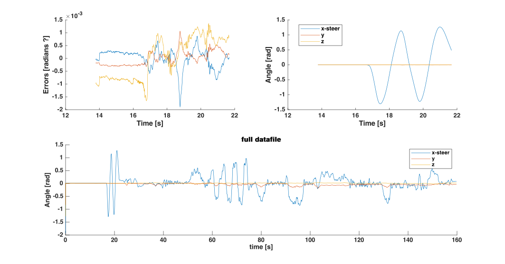

### Compute rotation around the hinge between the frame and the steer

#### Get axis of rotation

We computed the axis of rotation in the callibration trial using a least-squares approach [Ehrig2007].  We can compute the rotation of the steer in the coordinate system of the frame $R^{steer}_{frame}$ from the  orientation of the frame  in the world  $R^{frame}_{world}$ and of the steer in the world $R^{steer}_{world}$. These orientation of the world are based on the sensor fusion in Xsens. (Note: we attached one sensor the the frame of the bike and one sensor to the steer of the bike. We assume that all rotation occurs around a hinge representing the stem of the bike)
$$
R^{steer}_{frame} = R^{frame^T}_{world} * R^{steer}_{world}
$$
Hence we can compute the function axis in the steer ($\eta_{steer}$) and in the frame ($\eta_{steer}$) by solving this equation in a least-squares sense (we have n-frames for $R^{frame}_{steer}$ ). We solved the least-squares problem using a singular value decomposition in matlab (using function svd).
$$
\eta_{frame} = R^{frame}_{steer} \eta_{steer}
$$
In the next step we want to compute the rotation around this axis. Therefore, we adapted the coordinate system ($R$) of the frame such that the x-axis aligns with $\eta_{frame}$. 
$$
z = n_{frame} \times \begin{bmatrix} 0 & 1 & 0 \end{bmatrix}
$$

$$
y = z \times n_{frame}
$$
$$
R = \begin{bmatrix} n_{frame} & y & z \end{bmatrix}
$$

As a result we can compute the rotation around the axis of rotation in a rotation matrix ($R_{axis}$) and convert it to euler angles ($\theta_{stuurRot}$)
$$
R_{axis} = R*R^{steer}_{frame}
$$

$$
\theta_{stuurRot} = rotm2eul(R_{axis})
$$

 #### Result

This works well in most cases. In figure 1 you can see that the error on equations 2 is low during the callibration, there is only movement along the stem of the bike during the callibration trial. Futhermore, we steering angle looks fine during the whole movement.

In some trials, mainly with the normal bike, we see also rotation around the y and z axis, which we don't expect. On the one hand, this might be related to different sensor placement and the stem of the bike. On the other hand, the rotation is too large to be explained by a loose stem of the bike...

Figure 1: ...

*Figure 2*

#### Batch processing in matlab

You have to run the script *GetRotationAxisSteer_Subjects.m* to:

- Compute the axis of rotation in each subjects with the normal bike and the classic bike
- Compute the steering angle in all subjects and trials.

These scripts mainly rely on the functions

- getCallibrationPhase.m automatically detect the callibration phase
- GetHingeAxis.m to compute the rotation axis
- GetAngleSteer.m to compute the steering angle
- InterpolateRotMatrices.m to interpolate the orienations of the sensors when frames are missing (not very common). We first convert to rotation matrices to euler angles, interpolate the euler angles and convert to rotation matrices again.

### References

Ehrig2007: A survey of formal methods for determining functional joint axes

